# 🧠 TinyTask Frontend

Frontend for the **TinyTask** MERN Stack Project — a role-based question-solving platform with unique interfaces for **Admin**, **Seller**, and **Player** users.

🔗 **Live Website:** [https://tinytask-mern.web.app](https://tinytask-mern.web.app)  
🔌 **Backend API:** [https://tinytask-backend.vercel.app](https://tinytask-backend.vercel.app)

---

## 📸 UI Preview Screenshots

### 🏠 Home Page
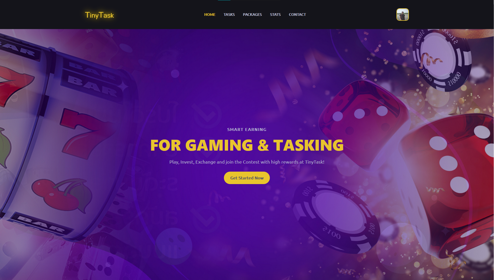
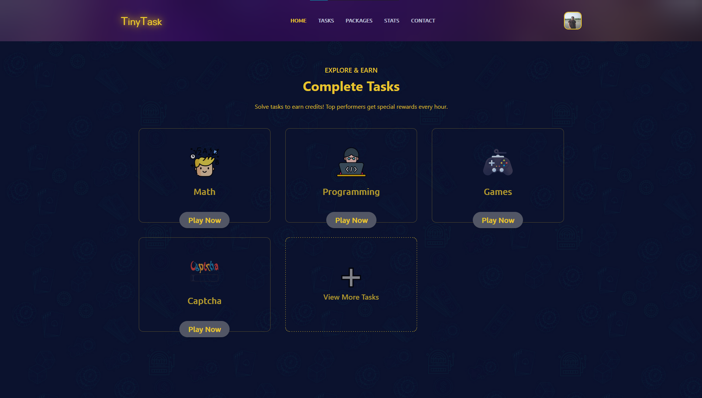


### 👑 Admin Dashboard
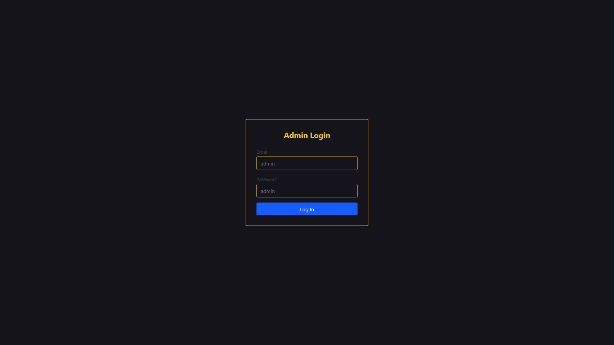
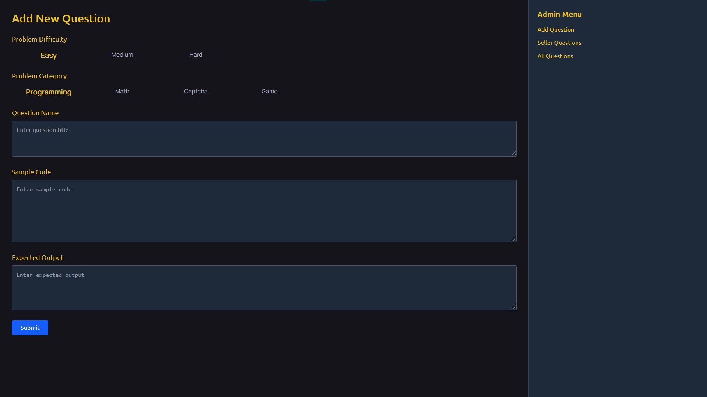
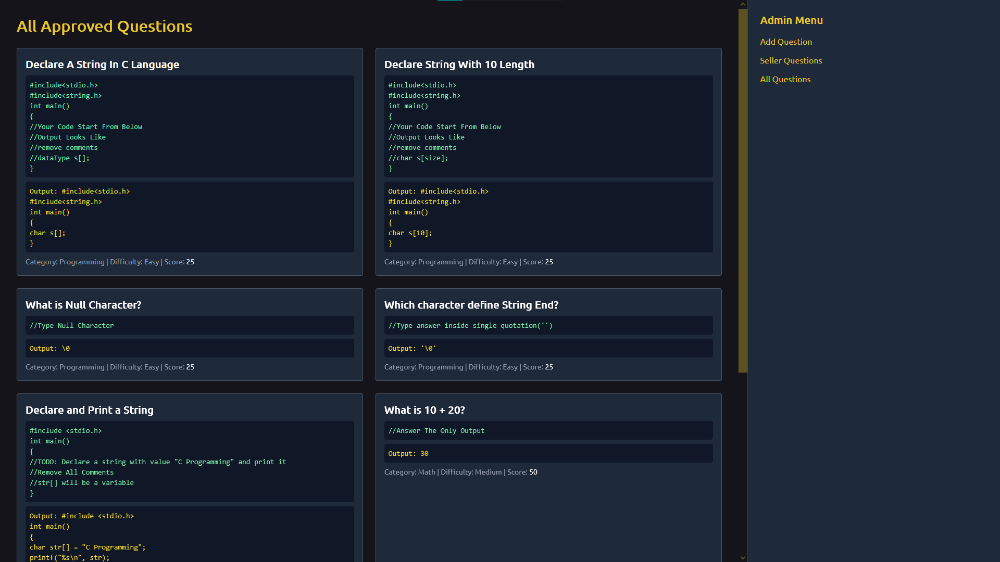
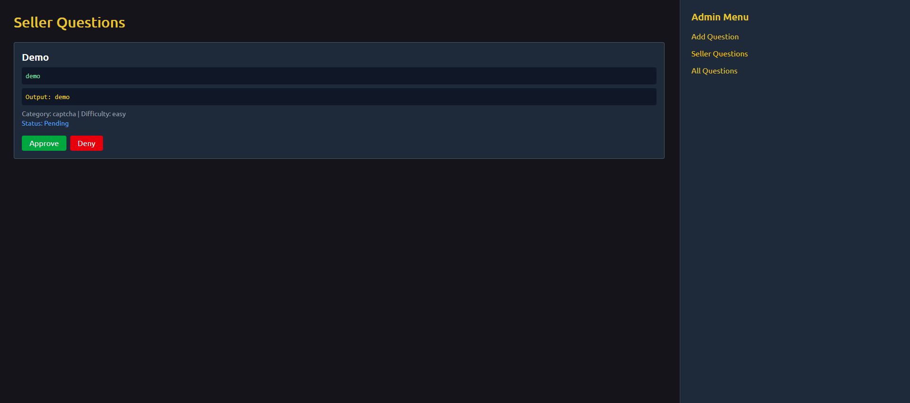

### 🛍️ Seller Dashboard

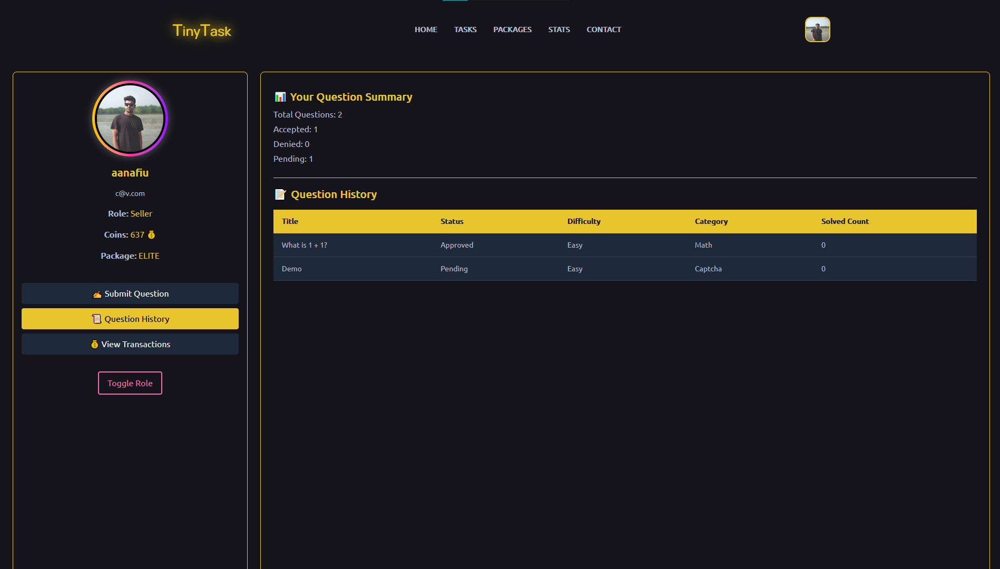
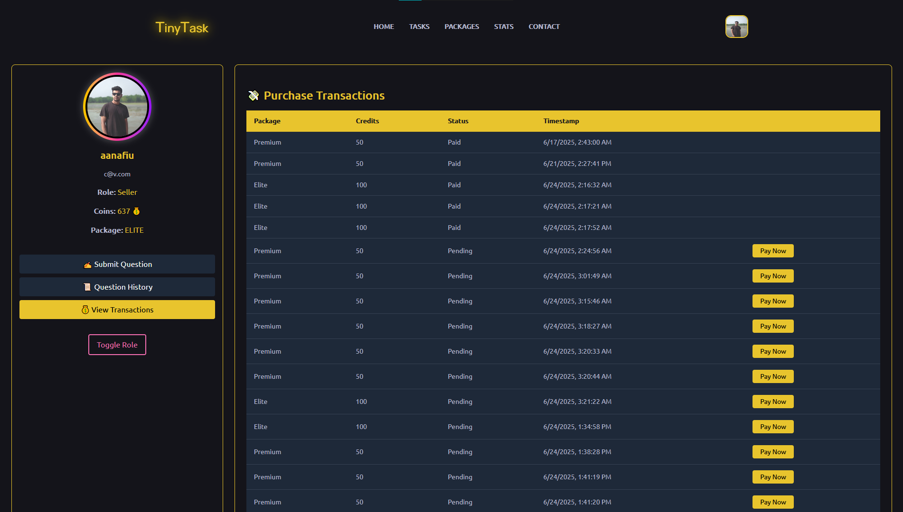
### Seller Package Wise Profile
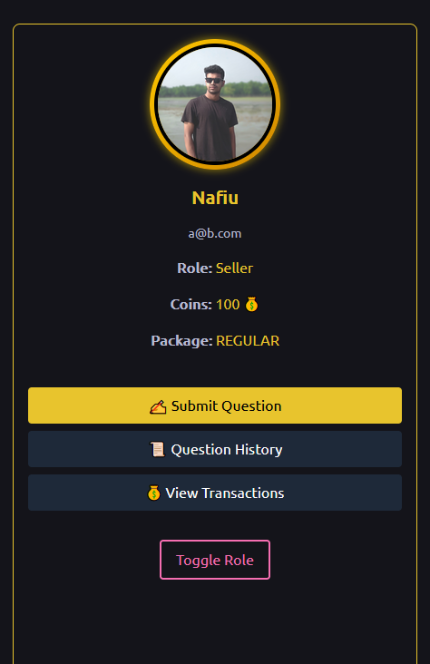
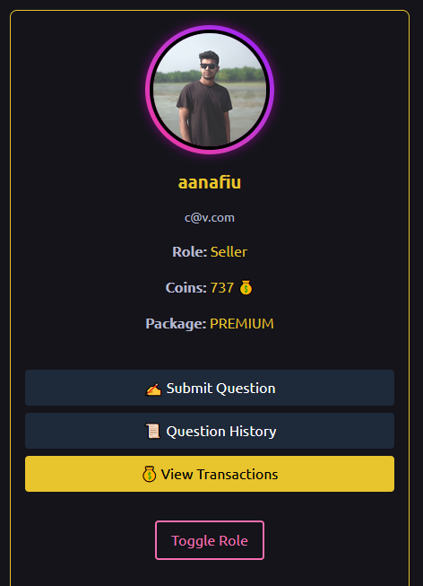
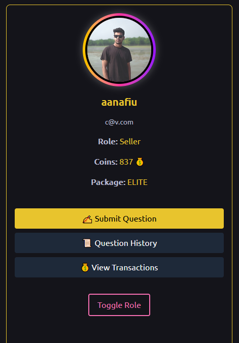

### 🎮 Player Dashboard
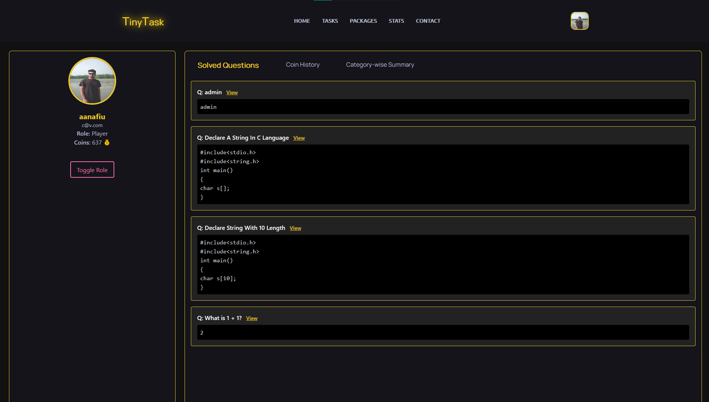
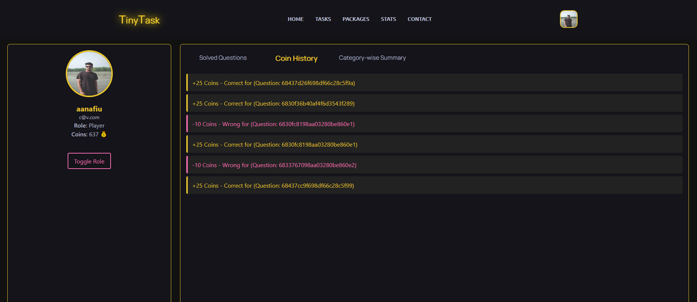
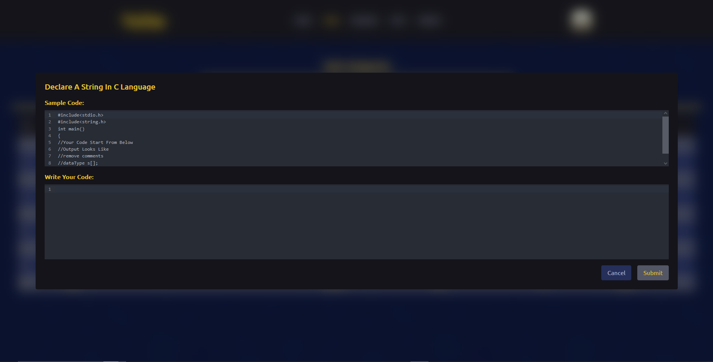
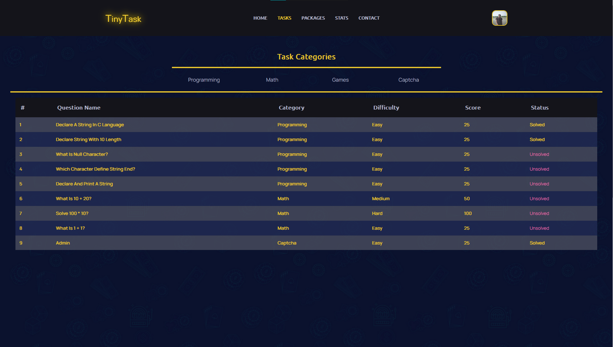

### Custom SweetAlert, MongoDB, SSLCommerz, Login, Register
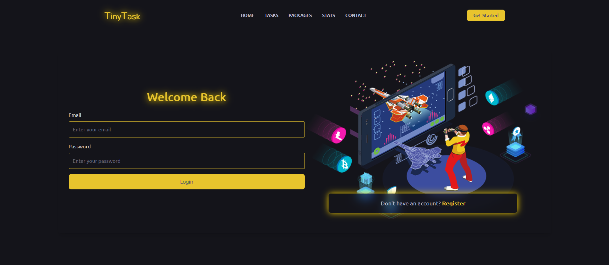
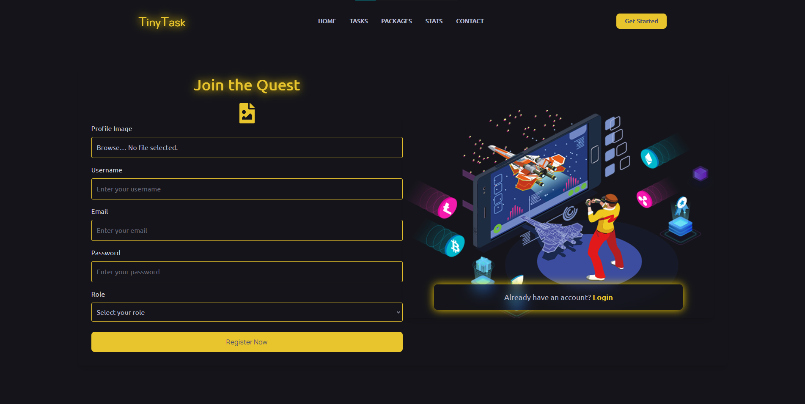
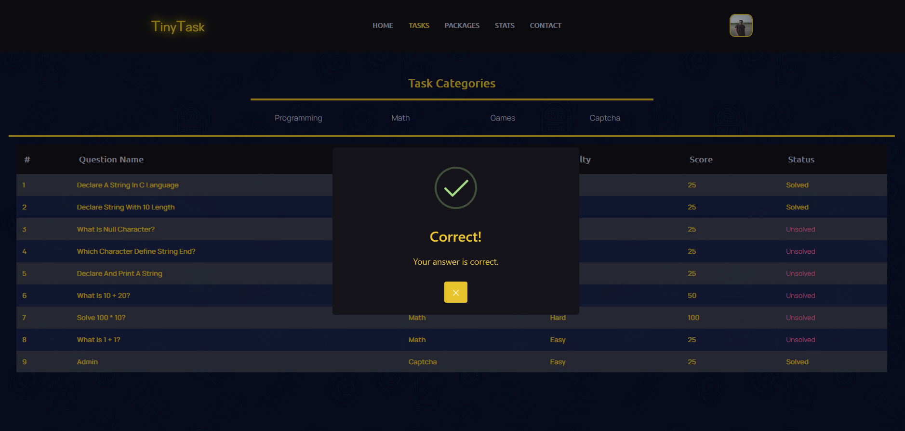


---

## 📁 Project Structure

```
src/
├── assets/                 # Static assets
├── Components/            # Reusable components
│   ├── Admin/             # Admin interface components
│   ├── AuthProvider/      # Firebase auth provider
│   ├── Footer/
│   ├── Hero/
│   ├── Loading/
│   ├── Nav/
│   ├── Packages/
│   ├── Profiles/          # Role-based profiles (Admin, Player, Seller)
│   ├── ScrollToTop/
│   ├── TaskSection/
│   ├── ToggleProfile.jsx  # Role switcher
│   └── User/              # User-based logic
├── Hooks/                 # Custom React hooks
├── Layouts/               # Shared layout wrappers
├── Router/                # App route definitions
├── index.css
├── main.jsx
```

---

## 🚀 Features

- 🔐 **Role-Based Dashboards**: Admin, Seller, Player
- 💬 **Firebase Authentication**: Login, Register, Role Management
- 📤 **Task & Question System**: Solve and submit categorized questions
- 💳 **Payment Integration**: SSLCommerz for Seller Packages
- 💰 **Coin System**: Earn and spend coins based on activities
- ⚙️ **Dynamic Routing** with protected routes

---

## 🔧 Tech Stack

- **React + Vite**
- **Tailwind CSS**
- **Firebase Auth**
- **React Router DOM**
- **Axios** for API calls

---

## 📦 Installation

```bash
git clone https://github.com/your-repo/tinytask-frontend.git
cd tinytask-frontend
npm install
npm run dev
```

> Make sure your `.env` file is set up properly.


---

## 🧪 Demo Test Accounts

| Role   | Email     | Password    |
|--------|-----------|-------------|
| Admin  | `admin`   | `admin`     |
| Seller | `c@v.com` | `123456`    |
| Player | `c@vcom`  | `123456`    |

---

## 📡 API Reference

Refer to the [Backend API Documentation](https://tinytask-backend.vercel.app) for full endpoint usage.
